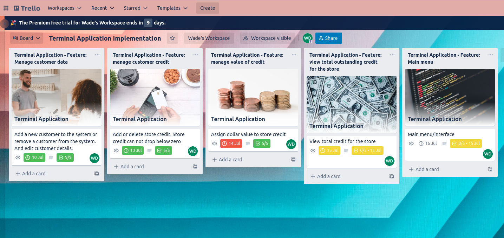

# T1A3 - Terminal Application: Customer store credit  


**Name:** Wade Doolan  
**Student number:** 12678  


<hr>  

## Source control repository

The source code, relevant documentation and commit history can be found in the GitHub repo below.

GitHub Repo: https://github.com/Wade008/Terminal-Application

<hr>  

## Code style guide  

The Python code used to develop this application complies with PEP 8 – Style Guide for Python Code (van Rossum, Warsaw and Coghlan, 2013).

<hr>

## Application purpose and features  
The purpose of this terminal application (The Store Credit App) is to allow retail staff in any store to easily track customer store credit. The application has the following features:

- A main menu that allows the user to easily select the required action.
- Ability to add customer store credit against a customer or remove store credit when a customer chooses to purchase an item with existing store credit. The user can also view total credit remaining for a customer in numbers and dollars.
- The ability to add a new customer to the system or remove a customer, if required. When adding a new customer the user is required to add a customer's first and last name, phone number and email address. There is also built-in functionality to edit an existing customer's details.
- Ability to assign a dollar value against one unit of credit.
- View total credit outstanding for the store in numbers and dollars.

<hr> 

## Implementation Plan  
An implementation plan for this project was developed using Trello. The Trello board can be accessed here: https://trello.com/invite/b/wpKDgCUi/357581b1b74513e1c3144f4a0924360f/terminal-application-implementation


Please note: the Trello board includes five lists, with each list relating to a specific feature of the application. Inside each list is a card that contains a checklist with five or more items. The cards show the overall deadline for the relevant feature. And the checklists show a deadline relevant to each item.   

Screenshot of my Trello board:


<hr> 

## Help Documentation  

### How to install and run the application  

1. Download the required code for the application from GitHub: https://github.com/Wade008/Terminal-Application. The code can be downloaded by entering the following command in the Terminal ```  git clone git@github.com:Wade008/Terminal-Application.git ```

2. This application requires Python 3 to work. If required, download and install Python 3 from: https://www.python.org/downloads/  

3. The program also requires the termcolor Python package (https://pypi.org/project/termcolor/). This can be installed by entering the following command in the Terminal ``` pip install termcolor ```

4. Using the Terminal, navigate to the same directory the application code has been saved in and run the following command ``` ./startapp.sh YOUR_FIRST_NAME ```

5. You can also access help to start the application by enter the following command in the terminal ``` ./startapp.sh help ```  


### How to use the application  

The Store Credit App - Help Documentation

The Store Credit App allows retail staff in any store to easily track customer store credit and comes with a number of key features.

Feature: Main menu:

- The main menu lists all possible actions. To perform a specific action enter the letter shown inside [ ] at the prompt.

Feature: Update or view a customer's store credit:

- This feature can be accessed by entering the letter [a] in the main menu.
- You'll then be asked to enter the phone number or email address of the relevant custumer.
- If the customer exists in the system, the customer's name, credit balance and credit value in dollars will be shown.
- Follow the prompts to either [a] add credit, [b] subtract credit or return to the main menu.
- If adding or subtracting credit, enter the amount of credit to be added or removed.
- The new credit balance and value with be displayed.

Feature: Update or view a customer's details:

- This feature can be accessed by entering the letter [b] in the main menu.
- You'll then be asked to enter the phone number or email address of the relevant custumer.
- If the customer exists in the system, the customer's name, phone number and email address will be shown.
- Follow the prompts to either [1] edit the customer's details, [2] delete the customer from the system or return to the main menu.
- If editing the customer's details, select which field requires updating: [1] first name, [2] last name,[3] phone, [4] email. Note, only one field can be updated at a time.
- The program will advise if the field has been updated successfully.
- WARNING: If deleting a customer, the customer's details will be permanently removed from the system.

- This feature also includes adding a new customer to the system. Simply enter [c] in the main menu and follow the prompts. And by entering [d] in the main menu you can view all customers in the system.

Feature: Assign a dollar value to store credit:

- This feature can be accessed by entering the letter [f] in the main menu.
- Initially, the current value of one credit will shown.
- To update the value of a credit enter the letter [y] at the prompt. Then enter the new value in whole numbers only.

Feature: Calculate and view total outstanding credit and dollar value for the store:

- This feature is accessed by entering the [e] in the main menu.
- The current balance for outstanding store credit will be shown along with the current total value of the outstanding store credit.

<hr>  

## References  

van Rossum, G., Warsaw, B. and Coghlan, N. (2013). PEP 8 – Style Guide for Python Code | peps.python.org. [online] Python.org. Available at: https://peps.python.org/pep-0008/ [Accessed 8 Jul. 2022].

